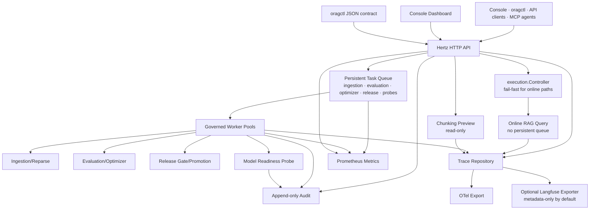
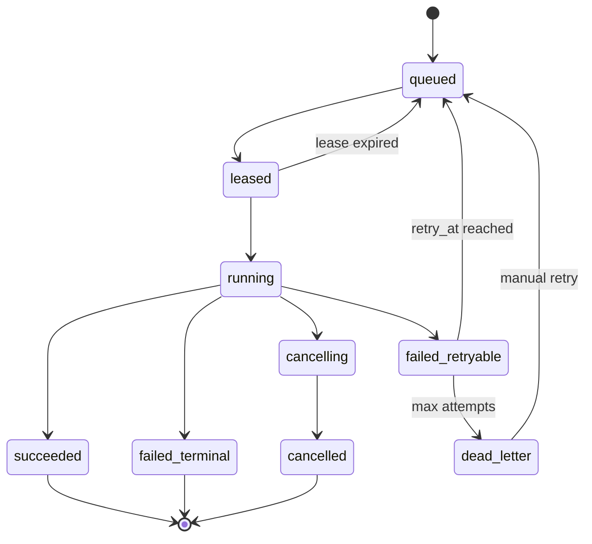
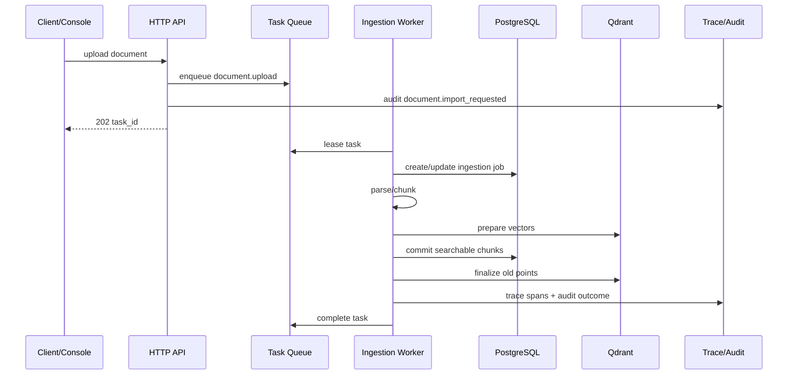
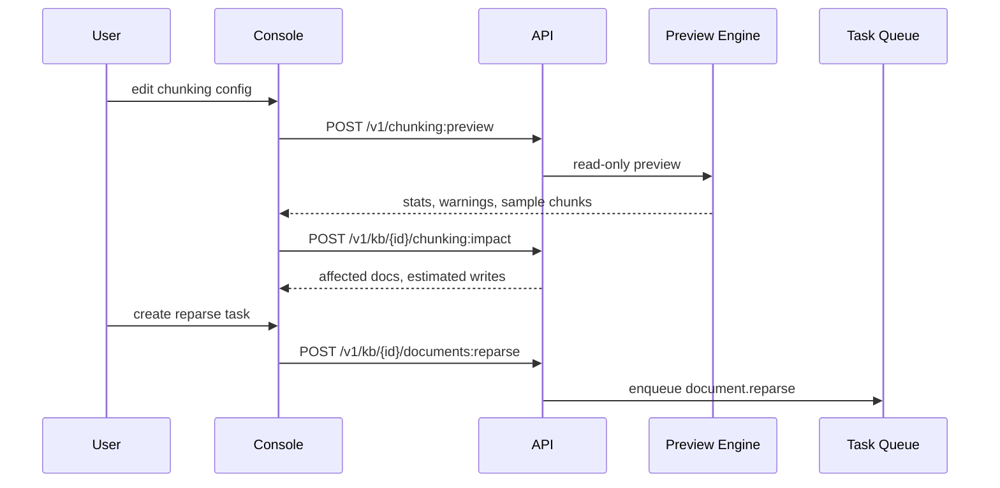

# RAG Platform Governance Technical Plan

**Goal:** 在不破坏 ORAG “在线查询 fail-fast、评测优先、可复现发布”定位的前提下，把当前 RAG 引擎底座升级为更可运营、可解释、可自动化、可审计的平台控制面。

**Architecture:** 保留 `internal/execution.Controller` 对在线请求的有限并发和 deadline 保护；新增持久任务队列治理、chunking preview/reparse impact、agent-first `oragctl` 契约、资源级 ownership/audit、保守版 Langfuse exporter、模型 readiness/debugger。所有新增能力共享同一套 trace、audit、principal、metrics 和 release lineage。

**Tech Stack:** Go, Hertz HTTP API, PostgreSQL, Qdrant, ORAG Console, `oragctl`, OpenAPI, MCP/Skills manifest, OpenTelemetry, optional Langfuse, Prometheus metrics.

---

## 背景

当前 ORAG 已经具备较强的 RAG 引擎和评测闭环基础：

- 在线请求通过 `internal/execution/controller.go` 做 fail-fast admission control，避免请求在进程内无限排队。
- 入库、检索、评测、optimizer、pipeline/release、MCP/self-check 等能力已经形成模块边界。
- 现有路线图明确强调评测优先、生产版本门禁、可复现 benchmark、审计和回滚。
- `docs/operations/README.md` 已定义 OTel 配置边界，并明确 Langfuse 还没有实际接入。
- `internal/auth/policy.go` 已有 tenant admin、project editor、project viewer 等 project-scoped 授权模型。

WeKnora 的参考价值不在于复制更多 provider、IM 渠道或完整 Wiki 产品，而在于它把 RAG 做成了多人可运营的知识平台：异步任务治理、chunking 可解释配置、agent-first CLI、资源归属与审计、模型调用追踪、模型配置测试。这些能力正好能补强 ORAG 从“可验证 RAG 引擎”到“可运营控制面”的边界。

## 设计原则

1. **在线查询继续 fail-fast。** `POST /v1/query` 和 `POST /v1/query:stream` 不进入持久队列；延迟敏感路径仍依赖 `execution.Controller` 的并发预算和 deadline。
2. **天然长任务进入持久队列。** ingestion、evaluation、optimizer、release、reparse、benchmark、model readiness probe 等任务不再依赖 HTTP 生命周期。
3. **同链路可追踪。** HTTP 请求、异步任务、RAG node、provider call、release gate、audit event 通过 `trace_id` 和 lineage 串联。
4. **默认不记录敏感内容。** prompt、completion、document content、provider key、原始附件和用户输入默认不进入 Langfuse/metrics/audit。
5. **CLI 和 API 同契约。** `oragctl` 不做另一套业务规则；命令、MCP、Skills 和 OpenAPI 尽量由 capability manifest 生成或校验。
6. **审计追加，不覆盖。** 发布、回滚、权限、配置、任务重试、模型测试等有副作用动作写 append-only audit event。
7. **先小而硬，再扩展。** 不在第一阶段实现完整 workspace/organization sharing、IM 生态或通用 Wiki Mode。

## 非目标

- 不把在线查询改成排队式异步问答。
- 不在第一阶段引入 Kafka、Temporal、Kubernetes operator 或复杂 workflow engine。
- 不复制 WeKnora 的多 IM 渠道、Chrome 插件、小程序、20+ provider 支持矩阵。
- 不默认向 Langfuse 或外部 APM 上传 prompt、completion、文档内容或用户 query。
- 不让 agent/CLI 在无明确授权时执行破坏性动作。
- 不在现阶段承诺完整多工作区共享空间模型。

## 总体架构



## 方案一：持久任务队列治理

### 当前问题

`execution.Controller` 的 fail-fast 策略适合在线请求，但 ingestion、evaluation、optimizer、release 具备以下特征：

- 任务可能持续数秒到数小时。
- 任务需要取消、重试、恢复、状态查询、失败诊断。
- 任务经常跨多个下游资源：PostgreSQL、Qdrant、模型 provider、对象存储、评测 runner。
- HTTP 客户端断开不应导致业务语义不可恢复。
- 生产运维需要看到 backlog、oldest pending age、retry、dead letter、worker utilization、provider limiter waiting。

### 目标

- HTTP 写入口快速创建 task，并返回 task id。
- worker pool 按任务类型和资源瓶颈治理，不和在线查询抢同一个等待队列。
- 任务状态持久化，可恢复、可取消、可重试、可审计。
- 队列指标可告警，可在 Console 展示。
- 现有同步 API 保持兼容窗口，但内部逐步迁移到 task-backed execution。

### Worker Pool 拆分

| Pool | Task types | 默认并发 | 下游瓶颈 | 说明 |
| --- | --- | ---: | --- | --- |
| `ingestion_core` | `document.import`, `document.upload`, `document.reparse` | 4 | parser, embedding, Qdrant, Postgres | 文档解析、chunk、embedding、staged activation 主路径。 |
| `ingestion_enrichment` | `chunk.contextualize`, `raptor.build`, `graph.extract`, `question.generate` | 4 | model provider, CPU | 模型密集型 enrichment，避免拖慢基础入库。 |
| `evaluation` | `evaluation.run`, `benchmark.run` | 2 | RAG query, judge model, dataset size | 长时间评测任务，必须支持 cancel/resume。 |
| `optimizer` | `optimization.run`, `optimization.resume`, `candidate.evaluate` | 1 | evaluation, provider quota | 默认单实例低并发，避免候选爆炸。 |
| `release` | `release.validate`, `release.promote`, `release.rollback` | 1 | DB transaction, audit | 发布门禁和回滚必须串行化或 project-scoped lock。 |
| `maintenance` | `backup.verify`, `cleanup.retention`, `trace.retention` | 1 | storage IO | 低优先级维护任务，不借用用户路径容量。 |
| `model_probe` | `model.readiness.check` | 2 | provider quota | 主动模型测试，带速率限制和审计。 |

第一阶段不需要引入复杂弹性 shared pool；先用固定 pool + per-task deadline + provider limiter。如果后续 backlog 数据证明某些 pool 长期空闲，再引入 shared capacity。

### 任务状态机



### 数据模型

新增 PostgreSQL 表：

```sql
CREATE TABLE task_queue (
  id TEXT PRIMARY KEY,
  tenant_id TEXT NOT NULL,
  project_id TEXT,
  task_type TEXT NOT NULL,
  pool TEXT NOT NULL,
  status TEXT NOT NULL,
  priority INTEGER NOT NULL DEFAULT 0,
  payload_json JSONB NOT NULL,
  payload_hash TEXT NOT NULL,
  idempotency_key TEXT,
  attempt INTEGER NOT NULL DEFAULT 0,
  max_attempts INTEGER NOT NULL DEFAULT 3,
  run_after TIMESTAMPTZ NOT NULL,
  lease_owner TEXT,
  lease_expires_at TIMESTAMPTZ,
  locked_resource_type TEXT,
  locked_resource_id TEXT,
  trace_id TEXT NOT NULL,
  created_by TEXT,
  created_at TIMESTAMPTZ NOT NULL,
  updated_at TIMESTAMPTZ NOT NULL,
  started_at TIMESTAMPTZ,
  completed_at TIMESTAMPTZ,
  error_code TEXT,
  error_message TEXT,
  last_heartbeat_at TIMESTAMPTZ
);

CREATE UNIQUE INDEX task_queue_idempotency_idx
  ON task_queue (tenant_id, task_type, idempotency_key)
  WHERE idempotency_key IS NOT NULL;

CREATE INDEX task_queue_ready_idx
  ON task_queue (pool, status, priority DESC, run_after, created_at);

CREATE INDEX task_queue_resource_lock_idx
  ON task_queue (tenant_id, locked_resource_type, locked_resource_id, status)
  WHERE locked_resource_type IS NOT NULL;
```

配套表：

```sql
CREATE TABLE task_events (
  id TEXT PRIMARY KEY,
  task_id TEXT NOT NULL REFERENCES task_queue(id),
  tenant_id TEXT NOT NULL,
  event_type TEXT NOT NULL,
  message TEXT,
  data_json JSONB,
  created_at TIMESTAMPTZ NOT NULL
);

CREATE TABLE task_artifacts (
  id TEXT PRIMARY KEY,
  task_id TEXT NOT NULL REFERENCES task_queue(id),
  tenant_id TEXT NOT NULL,
  artifact_type TEXT NOT NULL,
  uri TEXT NOT NULL,
  sha256 TEXT,
  size_bytes BIGINT,
  created_at TIMESTAMPTZ NOT NULL
);
```

### Go 接口

```go
type TaskStatus string

type Task struct {
    ID                 string
    TenantID           string
    ProjectID          string
    Type               string
    Pool               string
    Status             TaskStatus
    Payload            json.RawMessage
    IdempotencyKey     string
    Attempt            int
    MaxAttempts        int
    LockedResourceType string
    LockedResourceID   string
    TraceID            string
    CreatedBy          string
    RunAfter           time.Time
    LeaseExpiresAt     time.Time
    LeaseHolder        string
    LeaseGeneration    int64
}

type QueueRepository interface {
    Enqueue(ctx context.Context, task Task) (Task, error)
    Lease(ctx context.Context, pool, leaseHolder string, leaseDuration time.Duration, maxTasks int) ([]Task, error)
    Heartbeat(ctx context.Context, taskID, leaseHolder string, leaseGeneration int64, attempt int, leaseDuration time.Duration) error
    Complete(ctx context.Context, taskID, leaseHolder string, leaseGeneration int64, attempt int, result TaskResult) error
    Fail(ctx context.Context, taskID, leaseHolder string, leaseGeneration int64, attempt int, failure TaskFailure) error
    Cancel(ctx context.Context, tenantID, taskID, actorID string) error
    Get(ctx context.Context, tenantID, taskID string) (Task, bool, error)
    List(ctx context.Context, filter TaskFilter) ([]Task, Cursor, error)
}

type Handler interface {
    Handle(ctx context.Context, task Task, reporter ProgressReporter) error
}
```

`LeaseGeneration` is a repository-issued, monotonically increasing fencing token
for each task lease and is not derived from the pool-level worker identity.
`Heartbeat`, `Complete`, and `Fail` must compare the task ID, lease holder,
generation, attempt, and allowed active status atomically. A zero-row update
returns the typed `ErrLeaseLost`; workers cancel the stale handler context and
must not publish its success or failure.

### HTTP API

```http
POST /v1/tasks
GET /v1/tasks?status=&type=&pool=&project_id=&limit=&cursor=
GET /v1/tasks/{task_id}
POST /v1/tasks/{task_id}:cancel
POST /v1/tasks/{task_id}:retry
GET /v1/tasks/{task_id}/events
GET /v1/tasks:stats
```

业务入口逐步复用 task：

```http
POST /v1/knowledge-bases/{id}/documents
Prefer: respond-async

202 Accepted
{
  "task_id": "task_...",
  "ingestion_job_id": "job_...",
  "status_url": "/v1/tasks/task_..."
}
```

兼容策略：

- 没有 `Prefer: respond-async` 的旧调用可继续同步执行一个短窗口。
- 超过同步 deadline 时返回 `202` 和 task id，而不是让 HTTP 请求挂住。
- Console 默认使用异步路径。

### 指标

新增 Prometheus 指标：

| Metric | Type | Labels | 含义 |
| --- | --- | --- | --- |
| `orag_task_enqueued_total` | counter | `type`, `pool` | 入队数。 |
| `orag_task_completed_total` | counter | `type`, `pool`, `outcome` | 成功、失败、取消、DLQ。 |
| `orag_task_duration_ms` | histogram | `type`, `pool`, `outcome` | 端到端任务耗时。 |
| `orag_task_attempts_total` | counter | `type`, `pool`, `outcome` | 尝试次数。 |
| `orag_task_queue_depth` | gauge | `pool`, `status` | 队列深度。 |
| `orag_task_oldest_pending_age_ms` | gauge | `pool` | 最老 pending age。 |
| `orag_worker_active` | gauge | `pool` | 正在运行 worker 数。 |
| `orag_provider_limiter_wait_ms` | histogram | `provider`, `capability` | provider limiter 等待耗时。 |

所有 label 必须是低基数字段，禁止放入 tenant、task id、trace id、query、文档标题、错误原文。

### Console Dashboard

新增 Console “Runtime” 或 “Operations” 页面：

- Pool 总览：并发、active、queued、retry、DLQ、oldest age。
- Task 列表：状态、类型、项目、创建者、attempt、trace id、耗时。
- Task 详情：timeline、payload 摘要、错误码、关联 ingestion/evaluation/release、artifacts。
- DLQ 操作：只允许 project editor/admin 触发 retry；retry 写 audit event。
- Worker 状态：worker id、心跳、当前 task、版本号。

### 与 `execution.Controller` 的关系

- `execution.Controller` 保持在线 admission control。
- Worker 内部执行每个 task step 时仍可复用 operation budget，例如 evaluation runner 内部调用 RAG query 时走 query budget。
- Queue 不作为在线查询的等待室；它只承载用户可接受异步完成的工作。

## 方案二：Chunking 配置预览和可解释化

### 目标

让用户在上传/重解析之前理解 chunking 策略会如何影响召回、成本和重建范围：

- 预览不同策略产生的 chunk 数、大小分布、overlap、section breadcrumb。
- 展示 auto strategy 的选择理由和 rejected tier。
- 支持 parent-child chunking 的 child/parent 对照。
- 支持 reparse impact：哪些文档需要重建，预计 chunk/vector 数变化，是否影响 production pipeline。
- 全流程只读、短 timeout、无 embedding 调用、无 DB 写入。

### 策略模型

```go
type ChunkingStrategy string

const (
    ChunkingAuto      ChunkingStrategy = "auto"
    ChunkingHeading   ChunkingStrategy = "heading"
    ChunkingHeuristic ChunkingStrategy = "heuristic"
    ChunkingRecursive ChunkingStrategy = "recursive"
)

type ChunkingConfig struct {
    Strategy          ChunkingStrategy
    ChunkSize         int
    ChunkOverlap      int
    Separators        []string
    TokenLimit        int
    Languages         []string
    ParentChild       bool
    ParentChunkSize   int
    ChildChunkSize    int
    ContextualHeader  bool
}
```

### Document Profiler

新增 `internal/ingest/chunkpreview` 包，先实现纯文本 profiler：

| Signal | 示例 | 用途 |
| --- | --- | --- |
| markdown heading count | `#`, `##`, `###` | 判断 heading strategy。 |
| page break count | `\f`, PDF page marker | 判断 heuristic strategy。 |
| numbered section count | `1.2`, `第 3 章`, `Chapter 4` | 判断结构化文档。 |
| language hints | CJK ratio, Latin ratio | 选择 separator 和 token estimator。 |
| blank-line burst | 多空行段落 | 判断 paragraph boundary。 |
| table-like lines | pipe table, CSV-ish | 提醒表格文档风险。 |
| oversized paragraph | 超过 chunk size N 倍 | 触发 fallback/window split 说明。 |

### Preview 输出

```json
{
  "selected_strategy": "heading",
  "strategy_reason": "markdown_heading_count=18",
  "rejected_strategies": [
    {
      "strategy": "heuristic",
      "reason": "page_break_count=0"
    }
  ],
  "profile": {
    "estimated_language": "zh",
    "markdown_heading_count": 18,
    "page_break_count": 0,
    "oversized_paragraph_count": 2
  },
  "stats": {
    "chunk_count": 42,
    "min_chars": 120,
    "avg_chars": 510,
    "max_chars": 820,
    "p95_chars": 790,
    "estimated_tokens": 13200
  },
  "chunks": [
    {
      "index": 0,
      "kind": "child",
      "parent_index": 0,
      "start_offset": 0,
      "end_offset": 498,
      "chars": 498,
      "estimated_tokens": 210,
      "breadcrumb": "设计方案 > 背景",
      "preview": "..."
    }
  ],
  "warnings": [
    {
      "code": "table_like_content",
      "message": "Detected table-like lines; recursive text splitting may lose row semantics."
    }
  ]
}
```

### API

```http
POST /v1/chunking:preview
Authorization: Bearer <token>
Content-Type: application/json

{
  "text": "...",
  "file_name": "design.md",
  "config": {
    "strategy": "auto",
    "chunk_size": 512,
    "chunk_overlap": 80,
    "parent_child": true
  }
}
```

```http
POST /v1/knowledge-bases/{id}/chunking:impact
Authorization: Bearer <token>

{
  "config": {
    "strategy": "heading",
    "chunk_size": 512,
    "chunk_overlap": 80
  },
  "sample_document_ids": ["doc_..."],
  "mode": "sample"
}
```

Impact 返回：

- affected document count。
- sampled old/new chunk count。
- estimated vector writes。
- production pipeline 是否引用该 KB。
- 是否需要异步 reparse task。
- 建议的验证评测集。

### Console UX

在 KB 配置页或 ingestion wizard 中新增 “Chunking” 面板：

- 左侧配置：strategy、chunk size、overlap、parent-child、language。
- 右侧 preview：strategy badge、reason、warnings、stats、chunk cards。
- Impact tab：当前 KB 的重解析影响、预计耗时、需要的任务队列容量。
- Apply 行为：保存配置只写 KB config；重解析必须单独点击 `Create reparse task`。

### 测试

- Profiler 单测：Markdown、中文章节、PDF page break、长段落、表格样式。
- Preview 单测：只读、5s timeout、chunk stats 稳定。
- API 契约测试：schema、错误码、权限。
- Console 测试：最长 warning 和 chunk preview 不溢出。

## 方案三：Agent-first CLI 契约

### 目标

把 `oragctl` 从本地管理脚本升级为人类和 AI agent 都能稳定驱动的运维入口：

- 默认 JSON envelope。
- stdout 只输出数据，stderr 输出进度、警告和错误。
- 稳定 exit code。
- mutation 支持 `--dry-run`。
- destructive mutation 需要 confirmation guard。
- 命令 schema 可机读。
- 支持 profile、link current project/kb、doctor、wait、trace、task。

### 命令结构

```text
oragctl
  auth login|logout|status
  profile add|use|list|remove
  link --project <id> --kb <id>
  unlink
  doctor [--offline] [--scope health|storage|model|auth|all]
  schema [command]
  task list|view|wait|cancel|retry
  kb list|view|create|update|delete|status|check
  doc upload|import|wait|reparse|delete|chunks
  chunk preview|impact
  query ask|stream
  eval run|view|wait|compare
  optimizer run|view|wait|cancel|resume
  release validate|promote|rollback|view
  model list|test|readiness
  trace list|view|stats
  mcp serve
  skills install|list
  version
```

### JSON Envelope

成功：

```json
{
  "ok": true,
  "data": {},
  "meta": {
    "trace_id": "trace_...",
    "request_id": "req_...",
    "profile": "local"
  }
}
```

失败：

```json
{
  "ok": false,
  "error": {
    "type": "auth.unauthenticated",
    "message": "token expired",
    "exit_code": 3,
    "hint": "run `oragctl auth login`",
    "retryable": false,
    "trace_id": "trace_..."
  }
}
```

### Exit Codes

| Code | Meaning | Agent action |
| ---: | --- | --- |
| 0 | success | continue |
| 1 | local or unknown failure | inspect error, decide |
| 2 | flag/schema validation | fix arguments |
| 3 | auth failure | login or refresh token |
| 4 | resource not found | verify id/scope |
| 5 | input rejected | adjust payload |
| 6 | rate limited or queue full | backoff/retry |
| 7 | server/network transient | retry with backoff |
| 8 | contract drift | run schema/upgrade |
| 10 | confirmation required | ask human |
| 124 | timeout | extend timeout or inspect task |
| 130 | cancelled | stop |

### Dry-run 和确认

- 所有 mutation 支持 `--dry-run`，输出 plan，不触网或不写入，按命令风险决定。
- destructive 命令如 `kb delete`、`doc delete`、`release rollback`、`task retry --from-dlq` 首次返回 exit 10。
- `--yes` 只能在人类明确授权后使用。
- dry-run 输出包含 `idempotency_key`、target、expected audit action、rollback hint。

### Schema

`oragctl schema` 输出所有命令的机读契约：

```json
{
  "ok": true,
  "data": {
    "command": "doc wait",
    "used_for": "wait until ingestion task reaches terminal state",
    "required_flags": ["--task"],
    "optional_flags": ["--timeout", "--format"],
    "risk": "read",
    "output_schema": {}
  }
}
```

### 实施策略

- 第一阶段保持现有 `oragctl` 子命令可用，新增 `--format json` 和统一 error envelope。
- 第二阶段默认 JSON，`--format text` 给人类阅读。
- 第三阶段让 MCP/Skills 生成器读取同一 command schema，增加 drift gate。

## 方案四：资源级 Ownership 和 Audit Event

### 目标

在不引入完整 workspace/organization sharing 的前提下，把 project 内关键资源的所有权和审计补齐：

- 谁创建了 KB。
- 谁改了 pipeline。
- 谁创建、冻结、发布、回滚了 production version。
- 谁触发了 reparse/evaluation/optimizer/model probe。
- 哪个 API key 或 user principal 发起动作。

### Ownership 模型

资源表逐步补充：

| Resource | 字段 | 写权限初始规则 |
| --- | --- | --- |
| `projects` | `created_by`, `owner_principal_id` | tenant admin 或 project editor 根据现有策略。 |
| `knowledge_bases` | `created_by`, `owner_principal_id`, `project_id` | owner/editor/admin 可写。 |
| `documents` | `created_by`, `source_principal_id` | KB writer 可写。 |
| `pipelines` | `created_by`, `owner_principal_id` | project editor/admin 可写。 |
| `pipeline_versions` | `created_by`, `frozen_by` | project editor/admin 可冻结。 |
| `releases` | `created_by`, `approved_by`, `promoted_by`, `rolled_back_by` | project editor/admin，生产变更写 audit。 |
| `api_keys` | `created_by`, `last_used_principal_id` | tenant admin。 |
| `tasks` | `created_by`, `cancelled_by`, `retried_by` | 按 task target 授权。 |

第一阶段不改变现有角色枚举，只增加 resource ownership evidence 和 audit enforcement hooks。后续如确需 contributor owns own KB，再扩展 role matrix。

### Audit 表

```sql
CREATE TABLE audit_events (
  id TEXT PRIMARY KEY,
  tenant_id TEXT NOT NULL,
  project_id TEXT,
  actor_type TEXT NOT NULL,
  actor_id TEXT NOT NULL,
  actor_display TEXT,
  action TEXT NOT NULL,
  resource_type TEXT NOT NULL,
  resource_id TEXT NOT NULL,
  outcome TEXT NOT NULL,
  trace_id TEXT NOT NULL,
  task_id TEXT,
  request_id TEXT,
  idempotency_key TEXT,
  before_hash TEXT,
  after_hash TEXT,
  metadata_json JSONB,
  created_at TIMESTAMPTZ NOT NULL
);

CREATE INDEX audit_events_scope_idx
  ON audit_events (tenant_id, project_id, resource_type, resource_id, created_at DESC);

CREATE INDEX audit_events_action_idx
  ON audit_events (tenant_id, action, created_at DESC);
```

### Action Taxonomy

| Action | Resource | Outcome |
| --- | --- | --- |
| `kb.created` | knowledge_base | success/error |
| `kb.updated` | knowledge_base | success/error |
| `document.import_requested` | document/task | success/error |
| `document.reparse_requested` | document/task | success/error |
| `pipeline.updated` | pipeline | success/error |
| `pipeline.version_frozen` | pipeline_version | success/error |
| `release.validated` | release | success/error |
| `release.promoted` | release | success/error |
| `release.rolled_back` | release | success/error |
| `evaluation.requested` | evaluation/task | success/error |
| `optimizer.requested` | optimization/task | success/error |
| `task.cancelled` | task | success/error |
| `task.retried` | task | success/error |
| `model.readiness_tested` | model_config | success/error |
| `auth.access_denied` | target resource | denied |

### API

```http
GET /v1/audit-events?project_id=&resource_type=&resource_id=&action=&limit=&cursor=
GET /v1/projects/{id}/audit-events
GET /v1/knowledge-bases/{id}/audit-events
GET /v1/releases/{id}/audit-events
```

审计读取规则：

- tenant admin 可读 tenant 范围。
- project editor/viewer 可读自己项目范围。
- API key 的 audit visibility 由 key scope 决定。

### 安全边界

Audit metadata 不保存：

- prompt、completion、document content。
- provider key、JWT、API key 原文。
- 原始外部 URL query string 中可能带 secret 的部分。
- 大块错误堆栈。

保存 hash、配置摘要、版本号、trace id 和 resource id。

## 方案五：Langfuse/LLM Trace 映射

### 目标

提供可选 Langfuse exporter，让用户能查看模型调用链、token usage 和耗时，同时遵守 ORAG 当前隐私边界。

### 默认导出内容

| Field | 默认导出 | 说明 |
| --- | --- | --- |
| trace id | yes | ORAG trace id。 |
| tenant/project | no | 默认不导出；可本地 hash 后导出。 |
| node name | yes | retrieve/rerank/generate/embed。 |
| model provider | yes | `volcengine`, `mock`, etc. |
| model name | yes | 可配置是否导出。 |
| latency | yes | ms。 |
| token usage | yes | prompt/completion/total，若 provider 返回。 |
| cost estimate | yes | 仅估算字段。 |
| prompt | no | 默认禁用。 |
| completion | no | 默认禁用。 |
| document chunk text | no | 禁止默认导出。 |
| user query | no | 默认禁用，可截断/脱敏后 opt-in。 |

### 配置

```dotenv
LANGFUSE_ENABLED=false
LANGFUSE_HOST=https://cloud.langfuse.com
LANGFUSE_PUBLIC_KEY=
LANGFUSE_SECRET_KEY=
LANGFUSE_ENVIRONMENT=dev
LANGFUSE_RELEASE=
LANGFUSE_SAMPLE_RATE=0.1
LANGFUSE_FLUSH_INTERVAL=3s
LANGFUSE_FLUSH_AT=20
LANGFUSE_RECORD_PROMPTS=false
LANGFUSE_RECORD_COMPLETIONS=false
LANGFUSE_HASH_IDENTIFIERS=true
```

生产模式下：

- `LANGFUSE_RECORD_PROMPTS=true` 需要 `OBSERVABILITY_RECORD_PROMPTS=true` 一起开启。
- 如果没有显式 retention 和 redaction policy，启动应 warning 或拒绝开启敏感记录。

### Span 映射

| ORAG stage | Langfuse observation |
| --- | --- |
| HTTP request | trace root |
| RAG graph node | span |
| embedding call | generation or span with usage |
| dense/sparse retrieval | span |
| rerank call | generation/span with model + usage |
| chat generation | generation with usage |
| evaluation judge | generation with judge tags |
| async task | span linked to root trace |
| release gate | span + audit event |

### 异步任务 Trace Propagation

task payload 保存：

```json
{
  "trace_id": "trace_...",
  "parent_span_id": "span_...",
  "created_by": "principal_..."
}
```

worker lease 后：

- 从 task 恢复 trace context。
- 每个 handler 创建 task-level span。
- 子调用继续写 ORAG trace repository。
- exporter 异步批量发送，失败不影响业务。

### 实现组件

```go
type LLMObservation struct {
    TraceID       string
    ParentSpanID  string
    Name          string
    Provider      string
    Model         string
    Capability    string
    Latency       time.Duration
    PromptTokens  int
    OutputTokens  int
    TotalTokens   int
    CostUSD       float64
    Metadata      map[string]string
}

type LLMTraceExporter interface {
    Export(ctx context.Context, obs LLMObservation) error
    Flush(ctx context.Context) error
    Close(ctx context.Context) error
}
```

第一阶段可先实现 no-op exporter、in-memory test exporter 和 Langfuse HTTP exporter。所有 provider client 或 graph node 通过统一 observer 上报，避免业务代码依赖 Langfuse SDK 类型。

### 测试

- 默认不导出 prompt/completion 的单元测试。
- token usage 映射测试。
- exporter queue full 时静默丢弃并记录 metrics。
- Langfuse 配置缺 key 时 no-op。
- 异步 task trace propagation 测试。

## 方案六：Model Readiness / Debugger

### 目标

启动时 key 检查只能说明配置字段存在，不能证明模型名、额度、endpoint、网络、维度和 capability 可用。新增模型 readiness/debugger：

- 主动测试 chat、embedding、rerank、multimodal。
- 校验 embedding dimension 是否匹配 Qdrant collection。
- 记录 provider latency、错误码、quota/rate limit。
- 输出可审计诊断，不保存敏感 prompt/content。
- Console 可一键测试当前模型配置。

### Probe 类型

| Capability | Probe | 成功条件 |
| --- | --- | --- |
| chat | 极短固定 prompt | 返回非空文本，latency 在 timeout 内。 |
| embedding | 固定短文本 | 返回向量，维度等于配置或 collection。 |
| rerank | 两个短候选 | 返回排序和分数。 |
| multimodal | 小型内置 1x1 或 fixture image | 返回解析文本或明确 unsupported。 |
| provider auth | metadata or lightweight call | 区分 auth、quota、network、model_not_found。 |
| qdrant compatibility | collection config check | vector size/distance 匹配。 |

### API

```http
POST /v1/model-readiness:run
Authorization: Bearer <token>

{
  "provider": "volcengine",
  "capabilities": ["chat", "embedding", "rerank"],
  "model_overrides": {
    "chat_model": "doubao-..."
  },
  "timeout_ms": 10000,
  "dry_run": false
}
```

返回：

```json
{
  "run_id": "model_probe_...",
  "trace_id": "trace_...",
  "status": "completed",
  "results": [
    {
      "capability": "embedding",
      "status": "pass",
      "latency_ms": 320,
      "model": "doubao-embedding",
      "dimension": 1024
    }
  ],
  "warnings": [
    {
      "code": "qdrant_dimension_mismatch",
      "message": "Embedding dimension 1024 does not match collection dimension 768."
    }
  ]
}
```

### Console

新增 “Models” 或 “Settings > Model Debugger”：

- Capability matrix。
- 每个 provider/model 的 last tested time/status。
- Run test 按钮。
- 错误分类和建议。
- 与 `/readyz` 的差异提示：readyz 是配置/依赖门禁，readiness probe 是主动外部调用。

### 审计

每次 probe 写：

- `model.readiness_tested`
- actor、provider、capability、outcome、trace id。
- 不写 prompt、response、key。

## 跨主题数据流

### 异步入库



### Chunking Apply + Reparse



## API 和 OpenAPI 变更清单

新增或扩展：

- `POST /v1/tasks`
- `GET /v1/tasks`
- `GET /v1/tasks/{task_id}`
- `POST /v1/tasks/{task_id}:cancel`
- `POST /v1/tasks/{task_id}:retry`
- `GET /v1/tasks/{task_id}/events`
- `GET /v1/tasks:stats`
- `POST /v1/chunking:preview`
- `POST /v1/knowledge-bases/{id}/chunking:impact`
- `POST /v1/knowledge-bases/{id}/documents:reparse`
- `GET /v1/audit-events`
- `GET /v1/projects/{id}/audit-events`
- `GET /v1/knowledge-bases/{id}/audit-events`
- `POST /v1/model-readiness:run`
- `GET /v1/model-readiness/{run_id}`

所有 operation 增加：

- `x-orag-maturity: experimental`
- error model。
- auth action mapping。
- trace id response。
- audit side effect 标注。

## 文件结构规划

### Task Queue

- Create: `internal/taskqueue/types.go`
- Create: `internal/taskqueue/repository.go`
- Create: `internal/taskqueue/worker.go`
- Create: `internal/taskqueue/scheduler.go`
- Create: `internal/taskqueue/metrics.go`
- Create: `internal/storage/postgres/task_queue.go`
- Create: `internal/http/tasks.go`
- Modify: `internal/ingest/jobs.go`
- Modify: `internal/eval/service.go`
- Modify: `internal/optimizer/service.go`
- Modify: `internal/release/service.go`
- Modify: `internal/observability/metrics.go`

### Chunking Preview

- Create: `internal/ingest/chunkpreview/profile.go`
- Create: `internal/ingest/chunkpreview/preview.go`
- Create: `internal/ingest/chunkpreview/impact.go`
- Modify: `internal/ingest/service.go`
- Create: `internal/http/chunking.go`
- Modify: `console/src/features/projects` or add `console/src/features/chunking`

### CLI

- Modify: `cmd/oragctl/main.go`
- Create: `cmd/oragctl/envelope.go`
- Create: `cmd/oragctl/exitcodes.go`
- Create: `cmd/oragctl/schema.go`
- Create: `cmd/oragctl/profile.go`
- Create: `cmd/oragctl/task.go`
- Create: `cmd/oragctl/doctor.go`

### Ownership/Audit

- Create: `internal/audit/types.go`
- Create: `internal/audit/service.go`
- Create: `internal/storage/postgres/audit.go`
- Create: `internal/http/audit.go`
- Modify: `internal/auth/policy.go`
- Modify: project/KB/pipeline/release services to emit audit events.

### Langfuse/Model Debugger

- Create: `internal/llmtrace/exporter.go`
- Create: `internal/llmtrace/langfuse.go`
- Create: `internal/modelreadiness/types.go`
- Create: `internal/modelreadiness/service.go`
- Create: `internal/http/model_readiness.go`
- Modify: provider clients to report usage through observer.
- Modify: `docs/operations/README.md`

## Rollout Plan

### Phase 0: 契约和迁移准备

- 定义 task、audit、chunk preview、model readiness OpenAPI schema。
- 新增 migration，但默认不启用异步 worker。
- `oragctl schema` 输出新命令契约。
- 文档标注所有新能力为 `experimental`。

### Phase 1: Task Queue 最小闭环

- 实现 PostgreSQL queue repository。
- 实现 worker lease/heartbeat/complete/fail/cancel/retry。
- 将 ingestion reparse 和 evaluation run 接入异步任务。
- Console 增加最小 task list/detail。
- Prometheus 输出 queue depth、duration、DLQ。

### Phase 2: Chunking Preview

- 实现 read-only preview API。
- Console 增加 preview 面板。
- 实现 KB impact sampling。
- `oragctl chunk preview` 支持本地文本输入和远端 API。

### Phase 3: Agent-first CLI

- 统一 envelope 和 exit code。
- 增加 `doctor`、`task wait`、`doc wait`、`link`、`schema`。
- MCP/Skills 生成器增加 CLI schema drift gate。

### Phase 4: Audit 和 Ownership

- 增加 audit table/service。
- 覆盖 KB、pipeline、release、task、model readiness 的关键动作。
- Console 增加 project/resource activity。
- 权限不足写 `auth.access_denied`，注意去重。

### Phase 5: Langfuse 和 Model Debugger

- 实现 no-op/in-memory/Langfuse exporter。
- 默认 metadata-only。
- 实现 model readiness API 和 Console debugger。
- readiness 结果接入 audit、trace、task queue。

## 测试策略

### Unit Tests

- queue state machine。
- lease expiration 和 retry backoff。
- idempotency key。
- resource lock。
- chunk profiler/preview。
- CLI envelope/exit code。
- audit redaction。
- Langfuse exporter 默认不导出 prompt/content。
- model readiness 错误分类。

### Integration Tests

- PostgreSQL queue 并发 lease 只有一个 worker 获得 task。
- ingestion task 从 queued 到 succeeded。
- evaluation task 可 cancel。
- release task 对同 project 串行化。
- audit event 与 trace id 关联。
- `/v1/tasks:stats` 和 metrics 一致。

### Console/E2E

- 上传文档返回 task，任务完成后 KB 可查询。
- chunk preview 不写 DB。
- reparse impact 创建 task。
- task DLQ retry 需要权限并写 audit。
- model debugger 成功/失败状态可见。

### Contract Gates

```bash
GOTOOLCHAIN=go1.26.5 CGO_ENABLED=0 GOFLAGS=-tags=stdjson,gjson go test ./tests/contract -run 'TestOpenAPI|TestExamples' -v
GOTOOLCHAIN=go1.26.5 CGO_ENABLED=0 GOFLAGS=-tags=stdjson,gjson go test ./internal/taskqueue/... ./internal/audit/... ./internal/ingest/chunkpreview/... -v
GOTOOLCHAIN=go1.26.5 CGO_ENABLED=0 GOFLAGS=-tags=stdjson,gjson go test ./cmd/oragctl -v
```

## 风险和缓解

| Risk | Impact | Mitigation |
| --- | --- | --- |
| 异步队列导致任务重复执行 | 重复入库、重复发布 | idempotency key、resource lock、handler 幂等、staged activation。 |
| worker 与在线查询抢 provider quota | 查询延迟升高 | provider limiter 分 capability/pool，在线 query 优先级更高。 |
| DLQ 堆积但无人处理 | 入库/评测长期失败 | dashboard + alert + retry 操作 + runbook。 |
| audit 记录敏感信息 | 合规风险 | metadata allowlist、redaction、hash，不保存原文。 |
| Langfuse 外传内容 | 数据泄漏 | 默认 metadata-only，生产敏感记录双开关。 |
| CLI 契约破坏脚本 | 自动化失败 | schema drift gate、exit code matrix、兼容窗口。 |
| chunk preview 和真实 parser 不一致 | 用户误判 | preview 明确输入边界；真实文件 impact 使用 sample docs；结果标注 estimated。 |
| 模型 probe 产生额外费用 | 成本不可控 | 明确 capability、timeout、rate limit、audit、默认短 prompt。 |

## 验收标准

- 在线 `POST /v1/query` 在高负载下仍 fail-fast，不进入持久任务队列。
- 文档入库和评测可通过 task 查询、取消、重试、恢复。
- Console 能展示 pool、queue depth、DLQ、task timeline。
- Chunking preview 在 5 秒内返回，且无 DB 写入、无 embedding 调用。
- `oragctl task wait`、`doc wait`、`doctor`、`schema` 输出稳定 JSON envelope。
- KB、pipeline、release、task retry/cancel、model readiness 均有 audit event。
- Langfuse 默认只导出模型调用元数据和 token usage，不导出 prompt/content。
- Model readiness 能区分 auth、model not found、quota/rate limit、dimension mismatch、network timeout。
- OpenAPI、CLI schema、MCP/Skills artifact 不漂移。

## Open Questions

- 第一阶段 task queue 是否只使用 PostgreSQL，还是允许后续替换为 Redis/Asynq 兼容接口？
- evaluation runner 是否需要独立 worker binary，还是先内嵌在 `orag-api` 进程中？
- release promotion 的 resource lock 粒度是 project、environment，还是 pipeline？
- Langfuse exporter 是否作为 build tag 可选依赖，避免默认二进制引入额外依赖？
- Chunking impact 是否需要读取真实文档原文；如果原文未保存，应如何降级为配置级估算？
- API key principal 的 display 名称如何在 audit 中展示，既可定位又不泄露 key？

## References

- WeKnora README: https://github.com/Tencent/WeKnora
- WeKnora worker pool governance: https://github.com/Tencent/WeKnora/blob/main/docs/worker-pool-governance.md
- WeKnora chunking guide: https://github.com/Tencent/WeKnora/blob/main/docs/CHUNKING.md
- WeKnora CLI contract: https://github.com/Tencent/WeKnora/blob/main/cli/README.md
- ORAG execution controller: `internal/execution/controller.go`
- ORAG auth policy: `internal/auth/policy.go`
- ORAG operations documentation: `docs/operations/README.md`
